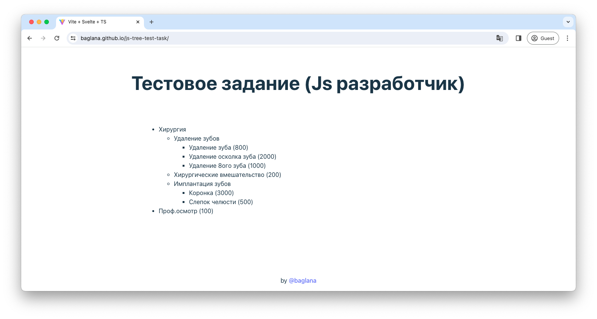

# JS Tree Test Task

This is a solution to JS Developer test task

## Table of contents

- [Overview](#overview)
    - [The challenge](#the-challenge)
    - [Screenshot](#screenshot)
    - [Link](#link)
- [My process](#my-process)
    - [Built with](#built-with)
    - [What I learned](#what-i-learned)

## Overview

### The challenge

- Create a tree view of the given data in JSON format
- Indent each tree level
- Node children should be sorted by the `sorthead` field
- Line format: name (price)

### Screenshot

### Link

- Demo
  URL: [https://baglana.github.io/skilled-elearning-landing-page/](https://baglana.github.io/skilled-elearning-landing-page/)

## My process

### Built with

- [Svelte](https://svelte.dev/) - JS framework
- [TS](https://www.typescriptlang.org/) - For type checking
- [Vite](https://vitejs.dev/) - Bundler

### What I learned

`<svelte:self>` built-in element that allows a component to contain itself recursively